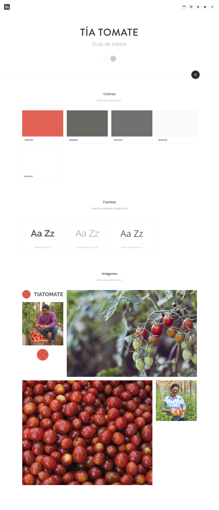
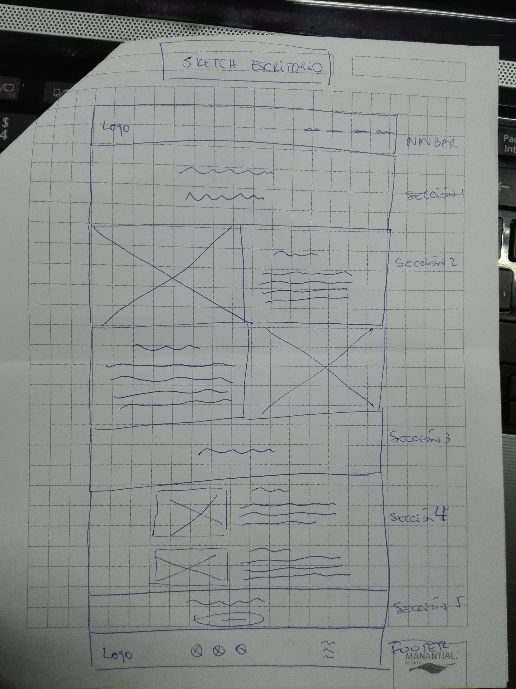
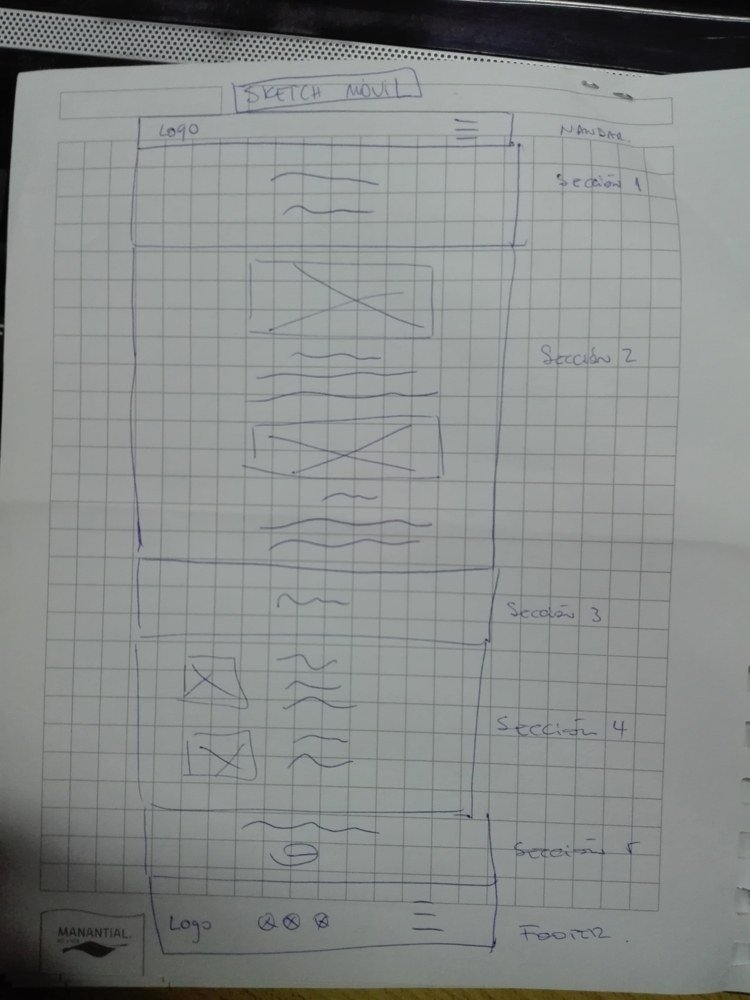

		
			-------- Proyecto: Tía Tomate ---------

1. 	Perfil del cliente: Empresa productora de tomates orgánicos.

	Nombre de la empresa: Tía Tomate.

2.	Solicitud: Realizar maqueta de la página web de la empresa.

3.	Requerimientos:
	3.1 Requerimientos visuales: los usuarios deben recibir la siguiente información:
	GENERALES
		- Reseña histórica de la empresa
		- Procedencia de los productores
		- Personas que trabajan cosechando las verduras
		- Mostrar la pasión sobre los tomates.
		- Dar enfásis a la compra de los productos
		- Mostrar logo de la empresa

	ESPECÍFICOS
		- Layout, usar boostrap
		- Fuentes se entregan en la guía de estilo: 
			Raleway-Bold.ttf, Raleway-ExtraLight.ttf, OpenSans-Regular.ttf,
		- Colores:
			#E56353: Para background secciones 1,3 5.
			#686963: Para background del footer
			#707070: Para background de primer texto sección 2, 
			#FAFAFA: Para background de segundo texto seccion 2 y sección 4, letras footer y navbar
			#FFFFFF: Para background navbar, letras secciones 1,3 y 5., background boton
		- Íconos para redes sociales usar font-awesome 
		- Las imágenes y logos son entregado spor el cliente.
		
	3.2 Requerimientos técnicos:

	GENERALES
		- Página web responsiva
		- Se especifican:Colores, fuentes e imagenes.
		- Se recibe mockup de la página web
		- El contenido de la página será creado por la persona a cargo de las redes sociales de la empresa
		- Debe contener un navbar, 5 secciones y un footer.

		- La primera sección: Muestra un mensaje o refran de la empresa, en 1 columna.
		- La segunda sección: Imagenes de los productos y plantaciones y sus respectivas descripciones, en 2 columnas.
		- La tercera sección: Muestra el titulo "Nosotros", en 1 columna.
		- La cuarta sección: Contienen 2 imagenes de productores cosechando y sus respectivas descripciones, en 1 columna.
		- La quinta sección: a través de un mensaje invita a conocer los productos y contienen un boton, en 1 columna.

	ESPECÍFICOS
		- secciones con grilla, usando boostrap
		- fotos de productores cosechando
		- fotos de productos y plantaciones
		- Párrafos no usar contenido fijo, usar ejemplo de texto que viene el el mockup "Una mañana, tras un sueño....."
		

4.	Archivos adjuntos
		- Mockups
		

		- Guía de estilos
		

		- Sketch escritorio
		

		- sketch móvil
		

5.	HTML y CSS
		- La estructura HTML se copiará la de boostrap
		- Se usara la metodologia BEM para la creación de clases.
		- El estilo se creara en una página aparte de el codigo de HTML, llamada miestilo.css

		

